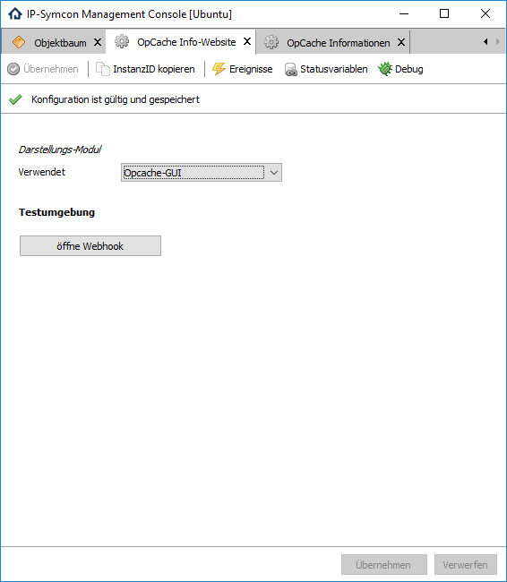

  

  

# OpCache Info-Website  
Bereitstellung der Stati des OpCache von PHP als Website.  

## Dokumentation

**Inhaltsverzeichnis**

1. [Funktionsumfang](#1-funktionsumfang)  
2. [Voraussetzungen](#2-voraussetzungen)  
3. [Software-Installation](#3-software-installation) 
4. [Einrichten der Instanzen in IP-Symcon](#4-einrichten-der-instanzen-in-ip-symcon)
5. [Statusvariablen und Profile](#5-statusvariablen-und-profile)
6. [WebHook](#6-webhook)
7. [PHP-Befehlsreferenz](#7-php-befehlsreferenz) 
8. [Anhang](#8-anhang)  
9. [Lizenz](#9-lizenz)

## 1. Funktionsumfang

 - Bereitstellung der Stati des Cache über externer Informations-Module als Webhook.  

## 2. Voraussetzungen

 - IPS 5.1

## 3. Software-Installation

 Dieses Modul ist Bestandteil der IPS OpCache Library.  

**IPS 5.1:**  
   Bei privater Nutzung:
     Über den 'Module-Store' in IPS.  
   **Bei kommerzieller Nutzung (z.B. als Errichter oder Integrator) wenden Sie sich bitte an den Autor.**  

## 4. Einrichten der Instanzen in IP-Symcon

Das Modul ist im Dialog 'Instanz hinzufügen' unter dem Hersteller 'Nall-chan' oder dem Schnellfilter 'OpCache' zufinden.  
  

In dem sich öffnenden Konfigurationsformular wird die externe Library ausgewählt, welche über den Webhook erreichbar ist.  

**Konfigurationsseite:**  
  

| Eigenschaft   | Typ     | Standardwert               | Funktion                               |
| :-----------: | :-----: | :------------------------: | :------------------------------------: |
| SubmodulePath | string  | opcache-status/opcache.php | PHP-Script für die Ausgabe per Webhook |

## 5. Statusvariablen und Profile

Werden nicht erzeugt.  

## 6. WebHook

Über den Webhook http://<IP>:<PORT>/hook/Opcache wird das eingestellte Ausgabemodul ausgeführt und im Browser dargestellt.  
Die direkte Darstellung im WebFront ist über z.B. eine String-Variable mit Profil HTML und IFrame möglich.  
Oder als 'Externe Seite' im WebFront-Konfigurator.  

## 7. PHP-Befehlsreferenz

Keine Befehle vorhanden.

## 8. Anhang

**Changlog:**  

Version 2.0:  
 - Release für IPS 5.1 und den Module-Store   

Version 1.0:  
 - Erstes offizielles Release  

## 9. Lizenz

  IPS-Modul:  
  [CC BY-NC-SA 4.0](https://creativecommons.org/licenses/by-nc-sa/4.0/)  
