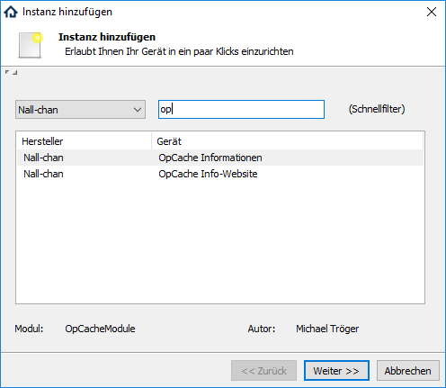
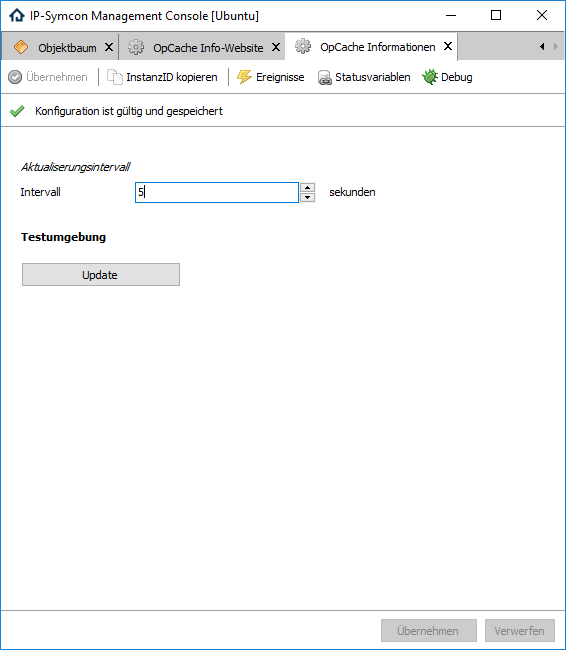
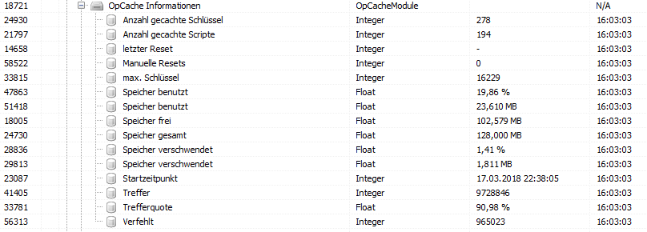
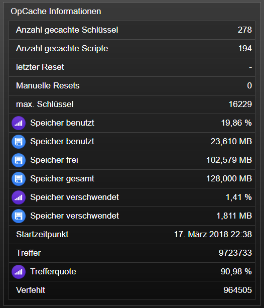

[](https://www.symcon.de/service/dokumentation/entwicklerbereich/sdk-tools/sdk-php/)
[]()
[](https://creativecommons.org/licenses/by-nc-sa/4.0/)  
[](https://www.symcon.de/forum/threads/30857-IP-Symcon-5-1-%28Stable%29-Changelog)
[](https://styleci.io/repos/125710396)  

# OpCache Information  
Darstellung der Stati des OpCache von PHP.  

## Dokumentation

**Inhaltsverzeichnis**

1. [Funktionsumfang](#1-funktionsumfang)  
2. [Voraussetzungen](#2-voraussetzungen)  
3. [Software-Installation](#3-software-installation) 
4. [Einrichten der Instanzen in IP-Symcon](#4-einrichten-der-instanzen-in-ip-symcon)
5. [Statusvariablen und Profile](#5-statusvariablen-und-profile)
6. [WebFront](#6-webfront)
7. [PHP-Befehlsreferenz](#7-php-befehlsreferenz) 
8. [Anhang](#8-anhang)  
9. [Lizenz](#9-lizenz)

## 1. Funktionsumfang

 - Darstellung der Stati des Cache.  

## 2. Voraussetzungen

 - IPS 5.0

## 3. Software-Installation

 Dieses Modul ist Bestandteil der IPS OpCache Library.  

**IPS 5.1:**  
   Bei privater Nutzung:
     Über den 'Module-Store' in IPS.  
   **Bei kommerzieller Nutzung (z.B. als Errichter oder Integrator) wenden Sie sich bitte an den Autor.**  

## 4. Einrichten der Instanzen in IP-Symcon

Das Modul ist im Dialog 'Instanz hinzufügen' unter dem Hersteller 'Nall-chan' oder dem Schnellfilter 'OpCache' zufinden.  
  

In dem sich öffnenden Konfigurationsformular muss noch ein Intervall in Sekunden für die Aktualisierung eingetragen werden.  
Ist der OpCache nicht aktiv, werden nach dem übernehmen der Einstellungen keine Variablen erzeugt.  

**Konfigurationsseite:**  
  

| Eigenschaft   | Typ     | Standardwert | Funktion                   |
| :-----------: | :-----: | :----------: | :------------------------: |
| Interval      | integer | 0            | Aktualisierung in Sekunden |


## 5. Statusvariablen und Profile

  

Folgende Statusvariablen werden automatisch angelegt.  

| Name                      | Typ     | Ident                       | Hinweis               | Profil            |
| :-----------------------: | :-----: | :-------------------------: | :-------------------: | :---------------: |
| Trefferquote              | float   | opcache_hit_rate            | Relativ in Prozent    | OpCache.Intensity |
| Treffer                   | integer | hits                        |                       |                   |
| Verfehlt                  | integer | misses                      |                       |                   |
| Anzahl gecachte Scripte   | integer | num_cached_scripts          |                       |                   |
| max. Schlüssel            | integer | max_cached_keys             |                       |                   |
| Anzahl gecachte Schlüssel | integer | num_cached_keys             |                       |                   |
| Startzeitpunkt            | integer | start_time                  | Unixtimestamp         | ~UnixTimestamp    |
| letzter Reset             | integer | last_restart_time           | Unixtimestamp         | ~UnixTimestamp    |
| Manuelle Resets           | integer | manual_restarts             |                       |                   |
| Speicher gesamt           | float   | total_memory                | Absolut in MB         | OpCache.MB        |
| Speicher frei             | float   | free_memory                 | Absolut in MB         | OpCache.MB        |
| Speicher frei             | float   | free_memory_percentage      | Relativ in Prozent    | OpCache.Intensity |
| Speicher benutzt          | float   | used_memory                 | Absolut in MB         | OpCache.MB        |
| Speicher benutzt          | float   | used_memory_percentage      | Relativ in Prozent    | OpCache.Intensity |
| Speicher verschwendet     | float   | wasted_memory               | Absolut in MB         | OpCache.MB        |
| Speicher verschwendet     | float   | current_wasted_percentage   | Relativ in Prozent    | OpCache.Intensity |

**Profile**:

| Name              | Typ   |
| :---------------: | :---: |
| OpCache.MB        | float |
| OpCache.Intensity | float |

## 6. WebFront

Die direkte Darstellung im WebFront ist möglich.  
  


## 7. PHP-Befehlsreferenz

```php
bool OPCACHE_Update(int $InstanzID);
```
Aktualisiert die Statusvariablen.  
Bei Erfolg wird `true` zurück gegeben.  
Im Fehlerfall wird eine Warnung erzeugt und `false`zurück gegeben.  


## 8. Anhang

**Changlog:**  

Version 2.0:  
 - Release für IPS 5.1 und den Module-Store   

Version 1.0:  
 - Erstes offizielles Release  

## 9. Lizenz

  IPS-Modul:  
  [CC BY-NC-SA 4.0](https://creativecommons.org/licenses/by-nc-sa/4.0/)  
